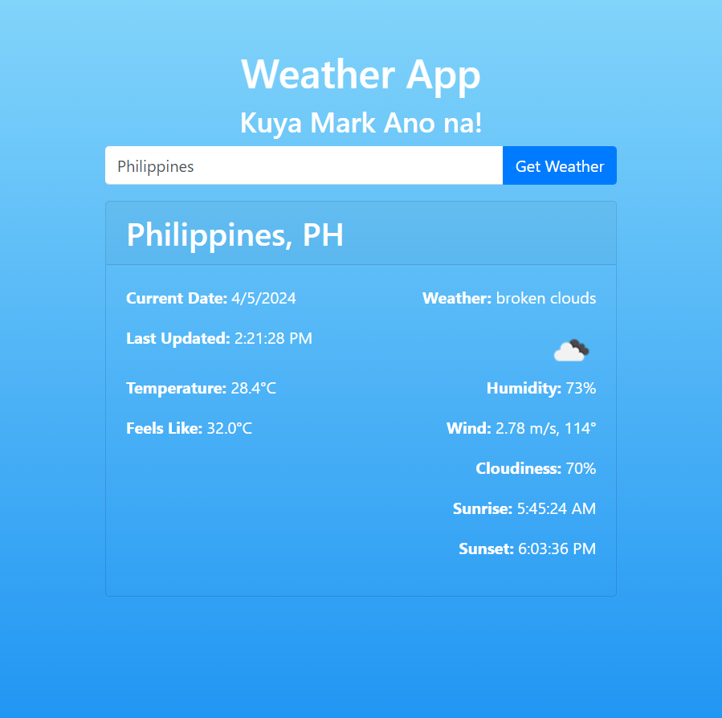

# Weather App - "Kuya Mark Ano na!"

## Overview

The Weather App is a simple and user-friendly web application designed to provide real-time weather information for any city around the world. It utilizes the OpenWeatherMap API to fetch accurate and up-to-date weather data, allowing users to quickly check the current weather conditions, temperature, humidity, wind speed, and more.

## Developer

- **Name:** Mark Kalalo
- **GitHub:** https://github.com/markkalalo

## Technologies Used

- **Vue.js:** A progressive JavaScript framework used for building the user interface.
  
- **Axios:** A promise-based HTTP client used to make requests to the OpenWeatherMap API.

- **Bootstrap:** A popular CSS framework used for styling the application and ensuring a responsive design.

- **OpenWeatherMap API:** A free weather API used to fetch real-time weather data.

## Key Features

### 1. Current Weather Data
- Displays the current weather conditions, such as description and icon.

### 2. Temperature Display
- Shows the current temperature in either Celsius or Fahrenheit, with an option to toggle between the two.
- Displays the 'feels like' temperature for a more accurate representation of how the weather feels.

### 3. Additional Weather Information
- Provides details on humidity, wind speed, cloudiness, sunrise, and sunset times.

### 4. User-Friendly Interface
- Features a clean and intuitive UI, making it easy for users to input a city name and retrieve weather information.

### 5. Error Handling
- Alerts the user with an error message if the entered city is not found, enhancing the user experience.

### 6. Responsive Design
- Built with a responsive design, ensuring optimal viewing experience across various devices, from desktops to mobile devices.

## How to Use

1. **Enter City Name:**  
   - Simply type the name of the city you want to check the weather for in the input field.

2. **Get Weather:**  
   - Click the "Get Weather" button to fetch and display the weather information for the entered city.

3. **Temperature Unit Toggle:**  
   - Click the "Switch to Fahrenheit" or "Switch to Celsius" button to toggle between Celsius and Fahrenheit temperature units.

---
